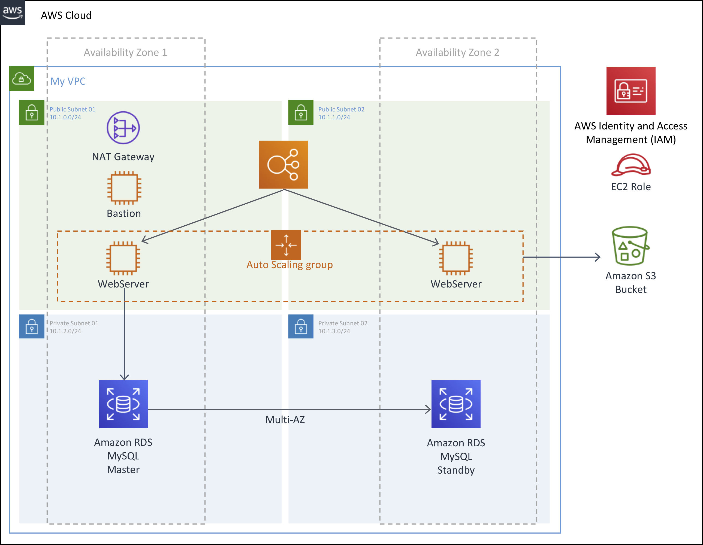

# Immersion Day Core Services with Auto Scaling

Hello, this is a self-paced workshop designed to explore the AWS Core Services.

In this workshop, you will build 2-tier application architecture with Auto Scaling that covers core services and best practices for Compute, Networking, Storage and Databases..

See the diagram below for a depiction of the complete architecture.

## Modules

This workshop is broken up into multiple modules.

For building out your architecture, you must complete the following modules in **US East (N. Virginia)** region in order before proceeding to the next:

1\. [Getting Started with AWS IAM](tutorials/IAM.md "AWS IAM")

2\. [Getting Started with Amazon VPC](tutorials/VPCFromScratch.md "Amazon VPC")

3\. [Getting Started with Application Load Balancer](tutorials/ApplicationLoadBalancer.md "Application Load Balancer")

4\. [Getting Started with Amazon S3](tutorials/S3.md "Amazon S3")

5\. [Getting Started with Amazon RDS](tutorials/RDS.md "Amazon RDS")

6\. [Getting Started with AWS Auto Scaling](tutorials/AutoScaling.md "AWS Auto Scaling")