# Getting Started with Amazon VPC

## 1. Create an Elastic IP for the NAT Gateway

1.1\. Open the Amazon EC2 console at https://console.aws.amazon.com/ec2/.

1.2\. In the navigation pane, choose **Elastic IPs**.

1.3\. Choose **Allocate new address**.

1.4\. For **IPv4 address pool**, choose **Amazon pool**.

1.5\. Choose **Allocate**, and close the confirmation screen.

1.6\. Note the **Allocation ID** for your newly created Elastic IP address; you enter this later in the VPC wizard.

## 2. Create a VPC using the Amazon VPC Wizard

2.1\. Open the Amazon VPC console at https://console.aws.amazon.com/vpc/.

2.2\. In the navigation pane, choose **VPC Dashboard**. From the dashboard, choose **Launch VPC Wizard**.

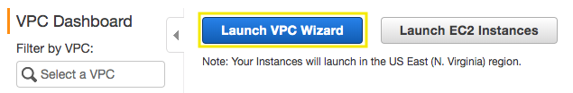

2.3\. Choose the second option, **VPC with Public and Private Subnets**, and then choose **Select**.

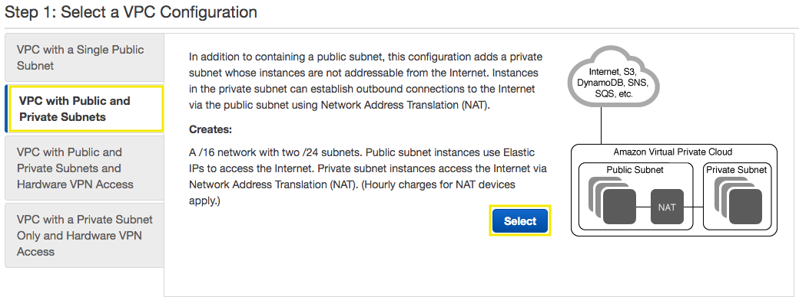

2.4\. On the configuration page, enter the following information and choose **Create VPC**.

* **IPv4 CIDR block:** `10.1.0.0/16`
* **VPC name:** `My VPC`
* **Public subnet's IPv4 CIDR:** `10.1.0.0/24`
* **Availability Zone:** `us-east-1a`
* **Public subnet name:** `Public Subnet 01`
* **Private subnet's IPv4 CIDR:** `10.1.2.0/24`
* **Availability Zone:** `us-east-1a`
* **Private subnet name:** `Private Subnet 01`
* **Elastic IP Allocation ID:** Select your Allocation ID previously created `eipalloc-XXXXXXXXXXXXXX`
* **Enable DNS hostnames:** `Yes`

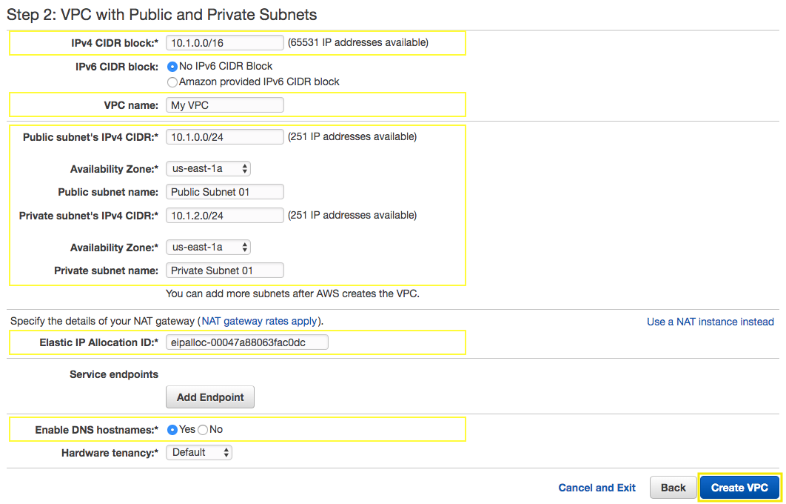

2.5\. A status window shows the work in progress, when the wizard is finished, choose **OK**.

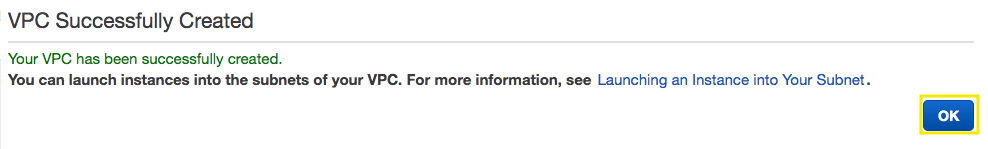

2.6\. Note that the page displays your VPCs. The VPC that you created is a nondefault VPC, therefore the **Default VPC** column displays **No**, copy the **VPC ID** of **My VPC**.

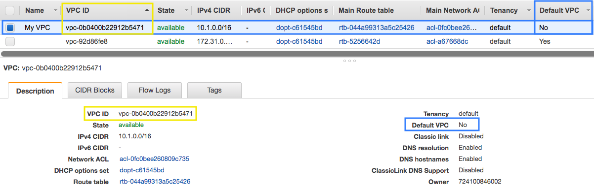

2.7\. In the navigation pane, choose **Subnets**, apply a filter using the **VPC ID** that you copied and press enter, you will see two subnets created from your VPC in availability zone a (us-east-1a).

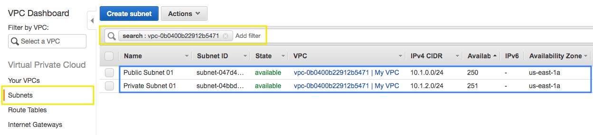

!!! info
    For greater availability, you should create at least one more of each subnet type in a different Availability Zone so that your VPC has both public and private subnets across two Availability Zones.

2.8\. For the second public subnet, choose **Create subnet** and enter the following information and choose **Create**.

* **Name tag**: `Public Subnet 02`
* **VPC**: `My VPC`
* **Availability Zone**: `us-east-1b`
* **IPv4 CIDR block**: `10.1.1.0/24`

2.9\. For the second private subnet, choose **Create subnet** and enter the following information and choose **Create**.

* **Name tag**: `Private Subnet 02`
* **VPC**: `My VPC`
* **Availability Zone**: `us-east-1b`
* **IPv4 CIDR block**: `10.1.3.0/24`

2.10\. With the filter applied with your VPC ID, now you will see the four subnets, two publics and two privates.

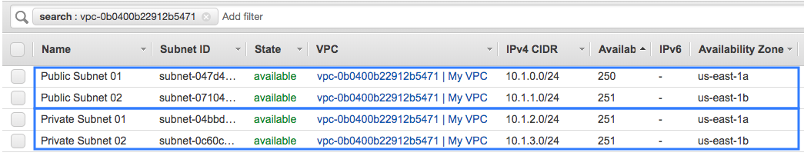

2.11\. In the navigation pane, choose **Route Tables** and apply a filter using your VPC ID, note that one of your route tables for the **Main** column displays **Yes**.

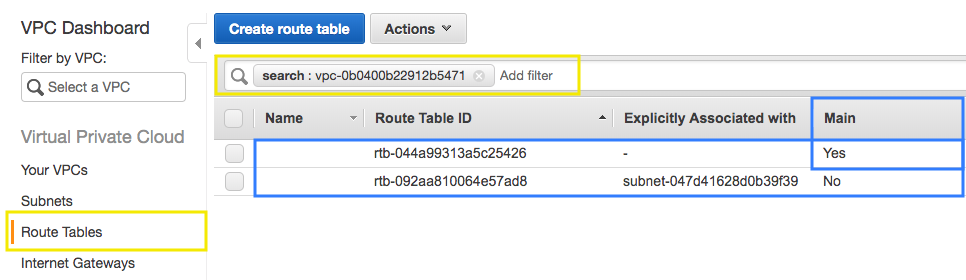

2.12\. Edit the names, mouse over the column **Name** and click on the pencil, for the **Main** route table type `Private Route` and for the other one type `Public Route`.

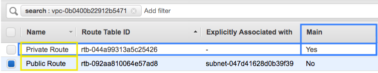

2.13\. Select your **Public Route**, click on **Subnet Associations** and click on **Edit subnet associations**.

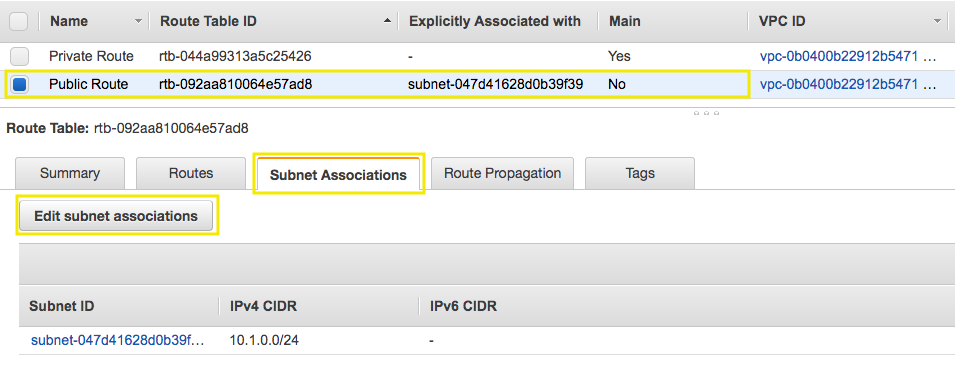

2.14\. Select the subnets **10.1.0.0/24** (Public Subnet 01) and **10.1.1.0/24** (Public Subnet 02) and click on **Save**.

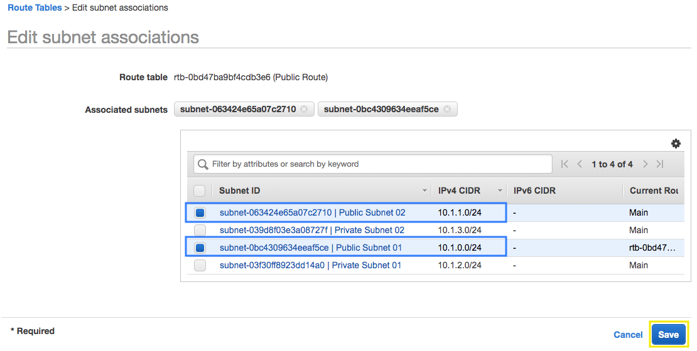

## 3. Create the Security Group for the Application Laod Balancer

3.1\. Open the Amazon VPC console at https://console.aws.amazon.com/vpc/.

3.2\. In the navigation pane, choose **Security Groups** and apply a filter using your VPC ID.

3.3\. Choose **Create security group**.

3.4\. For the **Security group name** and **Description** type `our-experiences-alb`. For **VPC** select your VPC ID **My VPC**, and choose **Create** and **Close**.

3.5\. Select the security group **our-experiences-alb**.

3.6\. On the **Inbound Rules** tab, choose **Edit rules**.

3.7\. In the dialog, choose **Add Rule** and do the following:

* **Type:** `HTTP`
* **Protocol:** `TCP`
* **Port Range:** `80`
* **Source:** `Anywhere 0.0.0.0/0`

3.8\. Choose **Save rules** and **Close**, you will have the following inbound rules.

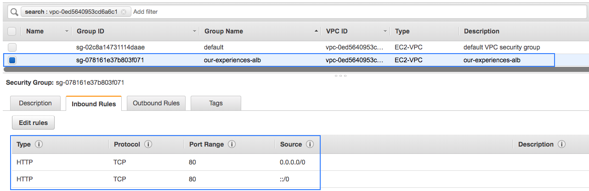

## 4. Create the Security Group for the WebServers

4.1\. Open the Amazon VPC console at https://console.aws.amazon.com/vpc/.

4.2\. In the navigation pane, choose **Security Groups** and apply a filter using your VPC ID.

4.3\. Choose **Create security group**.

4.4\. For the **Security group name** and **Description** type `our-experiences`. For **VPC** select your VPC ID **My VPC**, and choose **Create** and **Close**.

4.5\. Select the security group **our-experiences**.

4.6\. On the **Inbound Rules** tab, choose **Edit rules**.

4.7\. In the dialog, choose **Add Rule** and do the following:

* **Type:** `HTTP`
* **Protocol:** `TCP`
* **Port Range:** `80`
* **Source:** `Custom sg-XXXXXXX` Type `sg-` and select the security group ID for **our-experiences-alb**

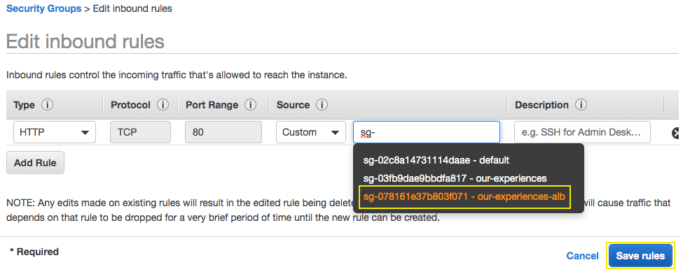

4.8\. Choose **Save rules** and **Close**, you will have the following inbound rules.

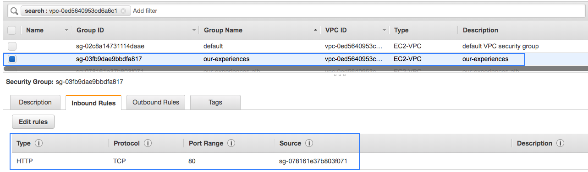

## 5. Create the Security Group for the Bastion Instance

5.1\. Open the Amazon VPC console at https://console.aws.amazon.com/vpc/.

5.2\. In the navigation pane, choose **Security Groups** and apply a filter using your VPC ID.

5.3\. Choose **Create security group**.

5.4\. For the **Security group name** and **Description** type `bastion`. For **VPC** select your VPC ID **My VPC**, and choose **Create** and **Close**.

5.5\. Select the security group **bastion**.

5.6\. On the **Inbound Rules** tab, choose **Edit rules**.

5.7\. In the dialog, choose **Add Rule** and do the following:

* **Type:** `SSH`
* **Protocol:** `TCP`
* **Port Range:** `22`
* **Source:** `Anywhere 0.0.0.0/0`

5.8\. Choose **Save rules** and **Close**, you will have the following inbound rules.

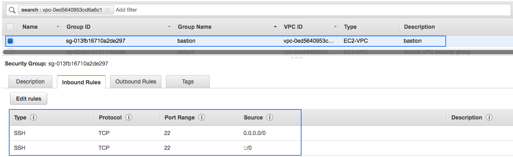

## 6. Create the Security Group for database RDS Instance

6.1\. Open the Amazon VPC console at https://console.aws.amazon.com/vpc/.

6.2\. In the navigation pane, choose **Security Groups** and apply a filter using your VPC ID.

6.3\. Choose **Create security group**.

6.4\. For the **Security group name** and **Description** type `our-experiences-db`. For **VPC** select your VPC ID **My VPC**, and choose **Create** and **Close**.

6.5\. Select the security group **our-experiences-db**.

6.6\. On the **Inbound Rules** tab, choose **Edit rules**.

6.7\. In the dialog, choose **Add Rule** and add the following rules:

* **Type:** `MYSQL/Aurora`
* **Protocol:** `TCP`
* **Port Range:** `3306`
* **Source:** `Custom sg-XXXXXXX` Type `sg-` and select the security group ID for **our-experiences**

Another rule:

* **Type:** `MYSQL/Aurora`
* **Protocol:** `TCP`
* **Port Range:** `3306`
* **Source:** `Custom sg-XXXXXXX` Type `sg-` and select the security group ID for **bastion**

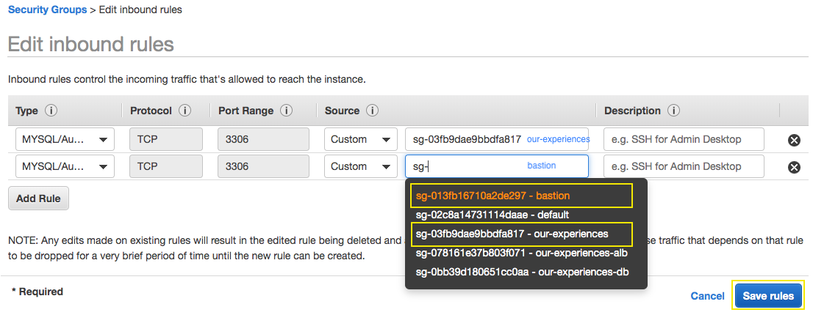

6.8\. Choose **Save rules** and **Close**, you will have the following inbound rules.

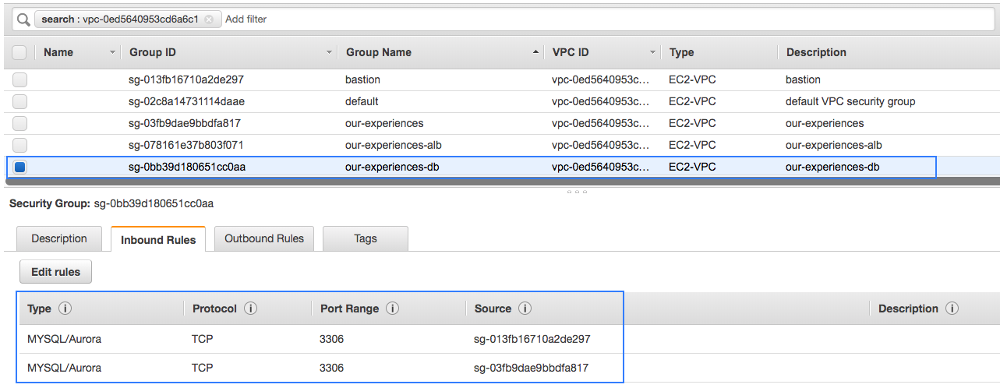

## 7. Create a new Key Pair

7.1\. Open the Amazon EC2 console at https://console.aws.amazon.com/ec2/.

7.2\. Click on **Key Pairs** in the NETWORK & SECURITY section near the bottom of the leftmost menu. This will display a page to manage your SSH key pairs. 

7.3\. To create a new SSH key pair, click the **Create Key Pair** button at the top of the browser window.

7.4\. In the resulting pop up window, type `ImmersionDay` into the Key Pair Name: text box and click **Create**.

7.5\. The page will download the file **ImmersionDay.pem** to the local drive.  Follow the browser instructions to save the file to the default download location.

7.6\. Remember the full path to the file .pem file you just downloaded.

**NOTE**: You will use the Key Pair you just created to manage your EC2 instances for the rest of the labs.

## 8. Create the Bastion EC2 Instance

**Bastion Hosts**: Including bastion hosts in your VPC environment enables you to securely connect to your Linux instances without exposing your environment to the Internet. After you set up your bastion hosts, you can access the other instances in your VPC through Secure Shell (SSH) connections on Linux. Bastion hosts are also configured with security groups to provide fine-grained ingress control.

8.1\. Open the Amazon EC2 console at https://console.aws.amazon.com/ec2/.

8.2\. Click on **Launch Instance**.

8.3\. In the Quick Start section, select the **Ubuntu Server 16.04 LTS (HVM)** AMI and click **Select**.

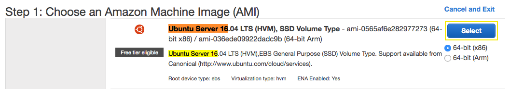

8.4\. In the Choose Instance Type tab, select the **t2.micro** instance size and click **Next: Configure Instance Desatils**.

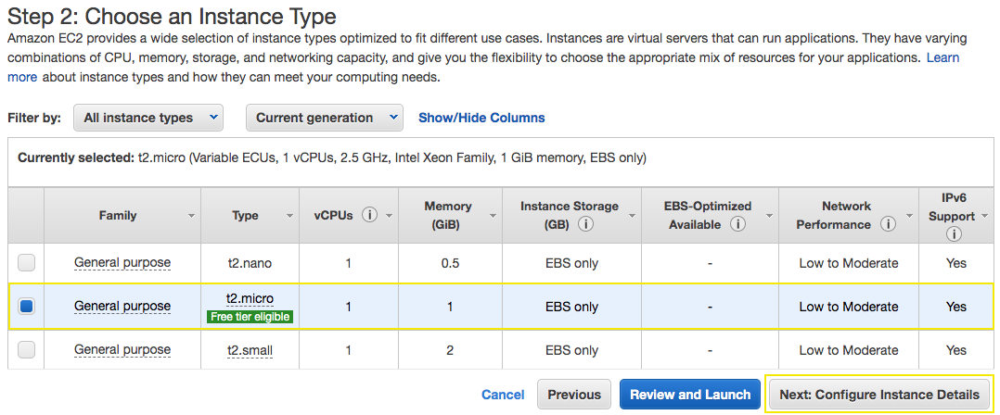

8.5\. On the Configure Instance Details page, select your network **My VPC** created and the **Public Subnet 01**, for Auto-assign Public IP select **Enable**. 

8.6\. Expand **Advanced Details** and copy and paste the following lines **As text**.

```bash
#!/bin/bash -xe
sudo apt-get update -y
sudo apt-get -y -f install mysql-client
```

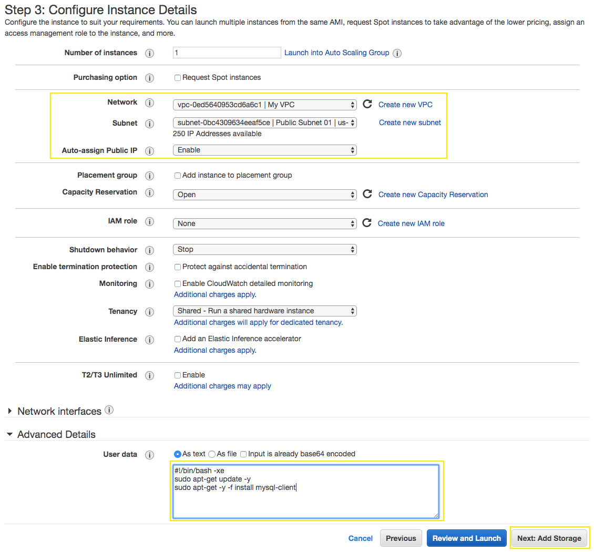

8.7\. Click **Next: Add Storage**.

8.8\. On this page you have the ability to modify or add storage and disk drives to the instance. For this lab, we will simply accept the storage defaults and click **Next: Add Tags**.

8.8\. In order to identify our instance with a friendly name add a tag to the instance, click on **Add Tag**, type a key of `Name` and the value of `Bastion`, click on **Next: Configure Security Group**.

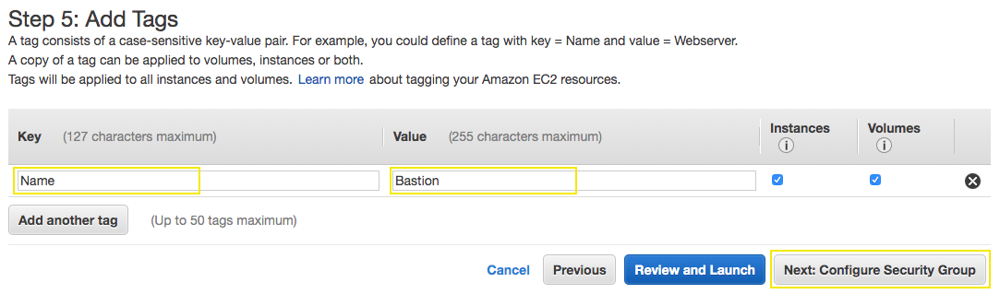

8.10\. You will be prompted to create a new security group, instead we are going to select **Select an existing security group** and check the security group name **bastion**.

8.11\. Choose **Review and Launch**.

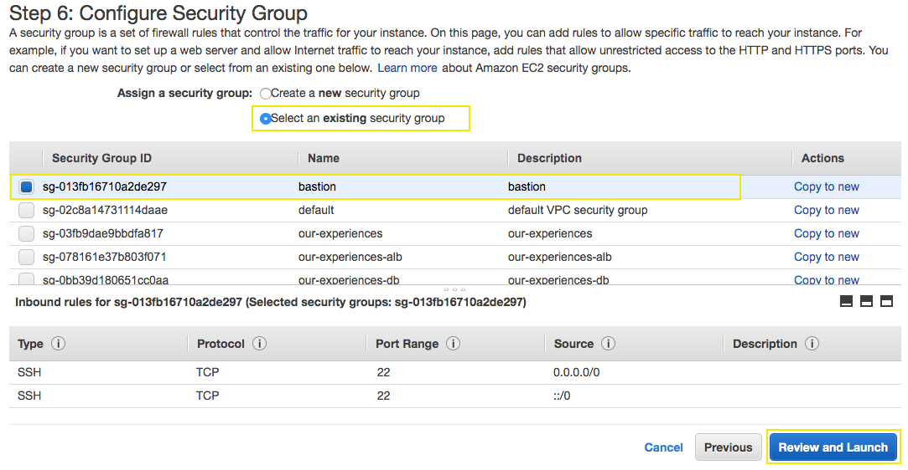

8.12\. Review your cofiguration and choices, and then choose **Launch**.

8.13\. Select the key pair **ImmersionDay** that you created and check the **"I acknowledge"** checkbox. Then click the **Launch Instances** button and **View Instances**.

[Connecting to Your Linux Instance from Windows Using PuTTY](https://docs.aws.amazon.com/AWSEC2/latest/UserGuide/putty.html).

[Connecting to Your Linux Instance Using SSH](https://docs.aws.amazon.com/AWSEC2/latest/UserGuide/AccessingInstancesLinux.html)