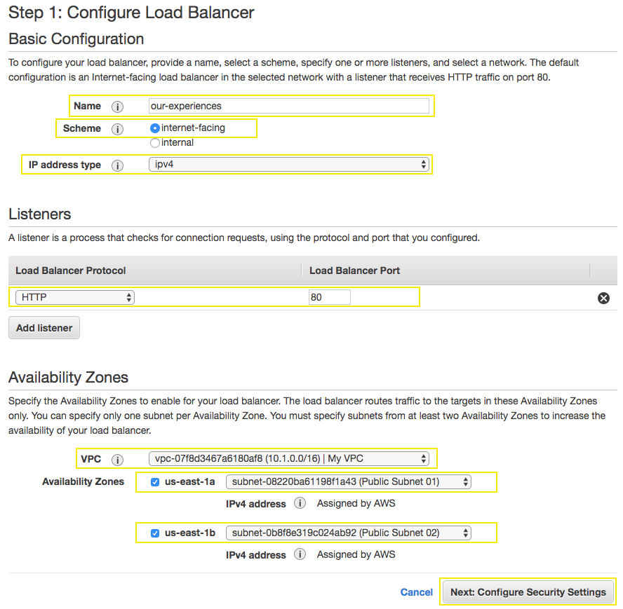

# Getting Started with Application Load Balancer

## 1. Create the Application Load Balancer for the Backend

1.1\. Open the Amazon EC2 console at https://console.aws.amazon.com/ec2/.

1.2\. In the navigation pane, under **LOAD BALANCING**, choose **Load Balancers**.

1.3\. Choose **Create Load Balancer**.

1.4\. On the **Select load balancer type** page, choose **Application Load Balancer** and then choose **Create**.

1.5\. Complete the **Configure Load Balancer** page as follows:

•	**Name:** `our-experiences`

•	**Scheme:** `internet-facing`.

•	**IP address type:** `ipv4`.

•	**Listeners:** The default listener that accepts `HTTP` traffic on port `80`.

•	**VPC** `My VPC`.

•	**Availability Zones:** Select the check box for the Availability Zones to enable for your load balancer. For **us-east-1a** select the **Public Subnet 01** and for **us-east-1b** select **Public Subnet 02**.

1.6\. Choose **Next: Configure Security Settings** and choose **Next: Configure Security Groups**.

1.7\. Select the existing security group **our-experiences-alb** and choose **Next: Configure Routing**.

1.8\. In the **Configure Routing** section, for **Name** type `our-experiences`, for Target type choose **Instance**.

1.8\. Expand **Advanced health check settings** section, for **Healthy threshold** type `2`.

1.9\. Choose **Next: Register Targets**.

1.10\. Choose **Next: Review**, click on **Create** and **Close**.