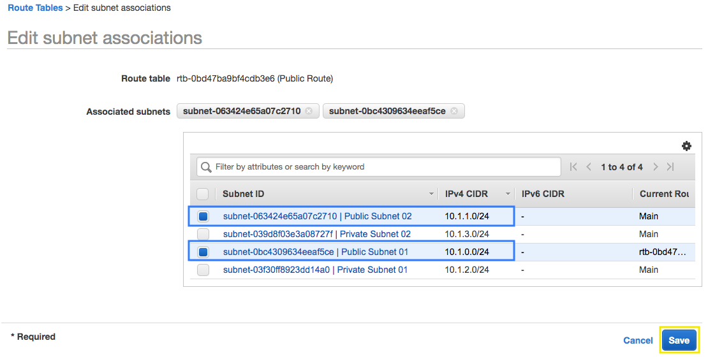

# Getting Started with Amazon VPC

## 1. Create a VPC from scratch

1.1\. Open the Amazon VPC console at https://console.aws.amazon.com/vpc/.

1.2\. In the upper-right corner of the AWS Management Console, confirm you are in the desired AWS region (e.g., Virginia).

1.3\. In the navigation pane, choose **Your VPCs** and click on **Create VPC**.

1.4\. For the Name tag type `My VPC` and use the IPv4 CIDR block of `10.1.0.0/16`, click on **Create** and click on **Close**.

1.5\. In the navigation pane, choose **Subnets**, we are going to create four subnets as follows:

| Name tag | VPC | Availability Zone | IPv4 CIDR block |
| ------:| -----------:| -----------:| -----------:|
| Public Subnet 01  | My VPC | us-east-1a | 10.1.0.0/24 |
| Public Subnet 02  | My VPC | us-east-1b | 10.1.1.0/24 |
| Private Subnet 01  | My VPC | us-east-1a | 10.1.2.0/24 |
| Private Subnet 02  | My VPC | us-east-1b | 10.1.3.0/24 |

1.6\. In the navigation pane, choose **Route Tables** and click **Create route table**.

1.7\. For the Name tag type `Public Route` and select `My VPC`, click on **Create** and click on **Close**.

1.8\. In the navigation pane, choose **Internet Gateways** and click **Create Internet gateway**, type Name Tag with `My IG`, click on **Create** and click on **Close**.

1.9\. Select `My IG` and click on **Actions > Attach to VPC**, choose `My VPC` and click **Attach**.

1.10\. In the navigation pane, choose **NAT Gateways** and click **Create NAT Gateway**.

1.11\. Select the Subnet ID for your Public Subnet 01 that you copied earlier, click on **Create New IP** and click on **Create a NAT Gateway** and click on **Close**.

1.12\. In the navigation pane, choose **Route Tables** and apply a filter using the VPC ID that you copied earlier, select the **Public Route**, click on **Routes** and click on **Edit Routes**, apply the following routes and click **Save routes**.

| Destination | Target | 
| ------:| -----------:| 
| 10.1.0.0/16 | local | 
| 0.0.0.0/0  | My IG (Internet Gateway) | 

1.13\. In the **Public Route**, click on **Subnet Associations** and click on **Edit subnet associations**, select the subnets **10.1.0.0/24** (Public Subnet 01) and **10.1.1.0/24** (Public Subnet 02) and click on **Save**.



1.14\. Now select the **Main** route table, this is our route table for private subnets, click on **Routes** and click on **Edit Routes**, apply the following routes and click **Save routes**.

| Destination | Target | 
| ------:| -----------:| 
| 10.1.0.0/16 | local | 
| 0.0.0.0/0  | NAT Gateway (Select the only one) |

1.15\. Now you have a VPC network with public and private subnets.

1.16\. In the navigation pane, choose **Your VPCs**.

1.17\. Select the VPC **My VPC** from the list, choose **Actions** and **Edit DNS Hostnames**. In the dialog box that opens, check the **enable** option, and then choose **Save**.

1.18\. Review the information of **My VPC** in the **Summary** tab. Make sure both settings for **DNS resolution** and **DNS hostnames** are enabled.
            


## 2. Create the Security Group for the Application Laod Balancer

2.1\. Open the Amazon VPC console at https://console.aws.amazon.com/vpc/.

2.2\. In the navigation pane, choose **Security Groups**.

2.3\. Choose **Create Security Group**.

2.4\. Enter a name of the security group `our-experiences-alb` and provide a description. Select the ID of your VPC **My VPC** from the VPC menu, and choose **Create** and **Close**.

2.5\. Select the security group **our-experiences-alb**.

2.6\. On the **Inbound Rules** tab, choose **Edit rules**.

2.7\. In the dialog, choose **Add Rule** and do the following:

•	**Type:** `HTTP`

•	**Protocol:** `TCP`

•	**Port Range:** `80`

•	**Source:** `Anywhere 0.0.0.0/0`

2.8\. Choose **Save rules** and **Close**.

## 3. Create the Security Group for the WebServers

3.1\. Open the Amazon VPC console at https://console.aws.amazon.com/vpc/.

3.2\. In the navigation pane, choose **Security Groups**.

3.3\. Choose **Create Security Group**.

3.4\. Enter a name of the security group `our-experiences` and provide a description. Select the ID of your VPC **My VPC** from the VPC menu, and choose **Create** and **Close**.

3.5\. Select the security group **our-experiences**.

3.6\. On the **Inbound Rules** tab, choose **Edit rules**.

3.7\. In the dialog, choose **Add Rule** and do the following:

•	**Type:** `HTTP`

•	**Protocol:** `TCP`

•	**Port Range:** `80`

•	**Source:** `Custom sg-XXXXXXX` Type `sg-` and select the security group ID for **our-experiences-alb**

3.8\. Choose **Save rules** and **Close**.

## 4. Create the Security Group for the Bastion Instance

4.1\. Open the Amazon VPC console at https://console.aws.amazon.com/vpc/.

4.2\. In the navigation pane, choose **Security Groups**.

4.3\. Choose **Create Security Group**.

4.4\. Enter a name of the security group `bastion` and provide a description. Select the ID of your VPC **My VPC** from the VPC menu, and choose **Create** and **Close**.

4.5\. Select the security group **bastion**.

4.6\. On the **Inbound Rules** tab, choose **Edit rules**.

4.7\. In the dialog, choose **Add Rule** and do the following:

•	**Type:** `SSH`

•	**Protocol:** `TCP`

•	**Port Range:** `22`

•	**Source:** `Anywhere 0.0.0.0/0`

4.8\. Choose **Save rules** and **Close**.

## 5. Create the Security Group for database RDS Instance

5.1\. Open the Amazon VPC console at https://console.aws.amazon.com/vpc/.

5.2\. In the navigation pane, choose **Security Groups**.

5.3\. Choose **Create Security Group**.

5.4\. Enter a name of the security group `our-experiences-db` and provide a description. Select the ID of your VPC **My VPC** from the VPC menu, and choose **Create** and **Close**.

5.5\. Select the security group **our-experiences-db**.

5.6\. On the **Inbound Rules** tab, choose **Edit rules**.

5.7\. In the dialog, choose **Add Rule** and add the following rules:

•	**Type:** `MYSQL/Aurora`

•	**Protocol:** `TCP`

•	**Port Range:** `3306`

•	**Source:** `Custom sg-XXXXXXX` Type `sg-` and select the security group ID for **our-experiences**

Another rule:

•	**Type:** `MYSQL/Aurora`

•	**Protocol:** `TCP`

•	**Port Range:** `3306`

•	**Source:** `Custom sg-XXXXXXX` Type `sg-` and select the security group ID for **bastion**

5.8\. Choose **Save rules** and **Close**.

### 6. Create a new Key Pair

6.1\. Open the Amazon EC2 console at https://console.aws.amazon.com/ec2/.

6.2\. Click on **Key Pairs** in the NETWORK & SECURITY section near the bottom of the leftmost menu. This will display a page to manage your SSH key pairs. 

6.3\. To create a new SSH key pair, click the **Create Key Pair** button at the top of the browser window.

6.4\. In the resulting pop up window, type `ImmersionDay` into the Key Pair Name: text box and click **Create**.

6.5\. The page will download the file **ImmersionDay.pem** to the local drive.  Follow the browser instructions to save the file to the default download location.

6.6\. Remember the full path to the file .pem file you just downloaded.

**NOTE**: You will use the Key Pair you just created to manage your EC2 instances for the rest of the labs.

### 7. Create the Bastion EC2 Instance

**Bastion Hosts**: Including bastion hosts in your VPC environment enables you to securely connect to your Linux instances without exposing your environment to the Internet. After you set up your bastion hosts, you can access the other instances in your VPC through Secure Shell (SSH) connections on Linux. Bastion hosts are also configured with security groups to provide fine-grained ingress control.

7.1\. Open the Amazon EC2 console at https://console.aws.amazon.com/ec2/.

7.2\. Click on **Launch Instance**.

7.3\. In the Quick Start section, select the **Ubuntu Server 16.04 LTS (HVM)** AMI and click **Select**.

7.4\. In the Choose Instance Type tab, select the **t2.micro** instance size and click **Next: Configure Instance Desatils**.

7.5\. On the Configure Instance Details page, select your network **My VPC** created and the **Public Subnet 01**, for Auto-assign Public IP select **Enable**. 

7.6\. Expand **Advanced Details** and copy and paste the following lines **As text**.

```bash
#!/bin/bash -xe
sudo apt-get update -y
sudo apt-get -y -f install mysql-client
```

7.7\. Click **Next: Add Storage**.

7.8\. On this page you have the ability to modify or add storage and disk drives to the instance. For this lab, we will simply accept the storage defaults and click **Next: Add Tags**.

7.8\. In order to identify our instance with a friendly name add a tag to the instance, type a key of `Name` and the value of `Bastion`, click on **Next: Configure Security Group**.

7.10\. You will be prompted to create a new security group, instead we are going to select **Select an existing security group** and check the security group name **bastion**.

7.11\. Choose **Review and Launch**.

7.12\. Review your cofiguration and choices, and then choose **Launch**.

7.13\. Select the key pair that you created in the beginning of this lab from the drop-down and check the **"I acknowledge"** checkbox. Then click the **Launch Instances** button and **View Instances**.

[Connecting to Your Linux Instance from Windows Using PuTTY](https://docs.aws.amazon.com/AWSEC2/latest/UserGuide/putty.html).

[Connecting to Your Linux Instance Using SSH](https://docs.aws.amazon.com/AWSEC2/latest/UserGuide/AccessingInstancesLinux.html)