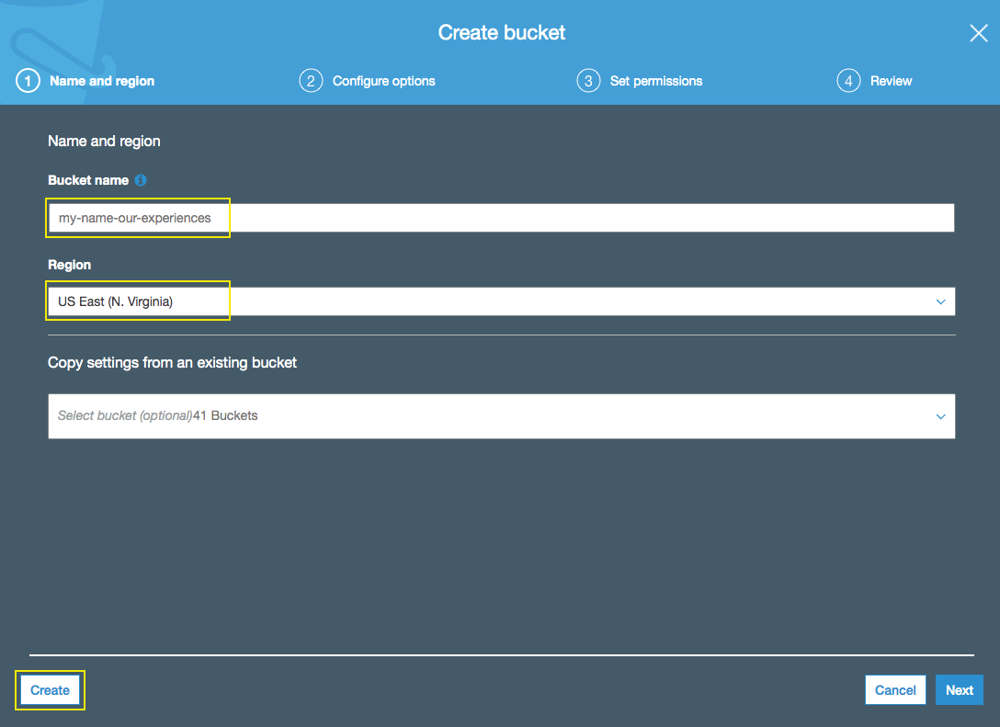
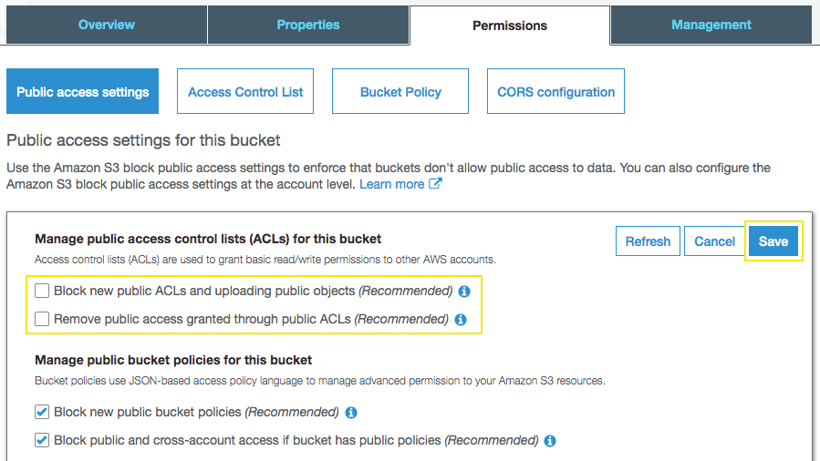

# Getting Started with Amazon S3

## 1. Create a bucket

1.1\.	Sign in to the AWS Management Console and open the Amazon S3 console at https://console.aws.amazon.com/s3/.

1.2\.	Choose **Create bucket**.

1.3\.	In the **Bucket name** field, type a unique DNS-compliant name for your new bucket, for example `<my-name>-our-experiences`.

•	The name must be unique across all existing bucket names in Amazon S3.

•	After you create the bucket you cannot change the name, so choose wisely.

•	Choose a bucket name that reflects the objects in the bucket because the bucket name is visible in the URL that points to the objects that you're going to put in your bucket.

1.4\.	For Region, choose **US East (N. Virginia)** as the region where you want the bucket to reside.

1.5\.	Choose **Create**.

## 2. Editing Public Access Settings for an S3 Bucket

2.1\.	Sign in to the AWS Management Console and open the Amazon S3 console at https://console.aws.amazon.com/s3/.

2.2\.	In the **Bucket name** list, choose the name of the bucket that you created **<my-name>-our-experiences**.

2.3\.	Choose **Permissions**.

2.4\.	Choose **Edit** to change the public access settings for the bucket.

2.5\.	Uncheck the following two options:

•	**Block new public ACLs and uploading public objects (Recommended).**

•	**Remove public access granted through public ACLs (Recommended).**

2.6\.	Choose **Save**.

2.7\.	When you're asked for confirmation, enter `confirm`. Then choose **Confirm** to save your changes.
