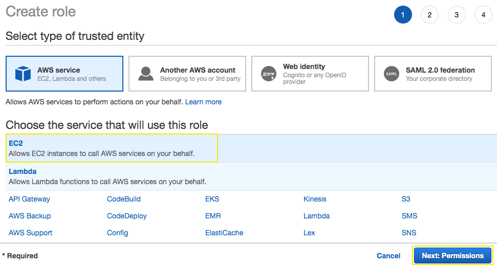
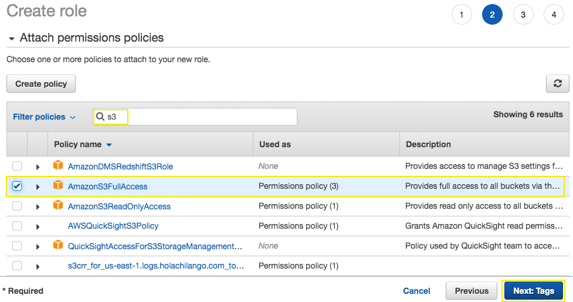
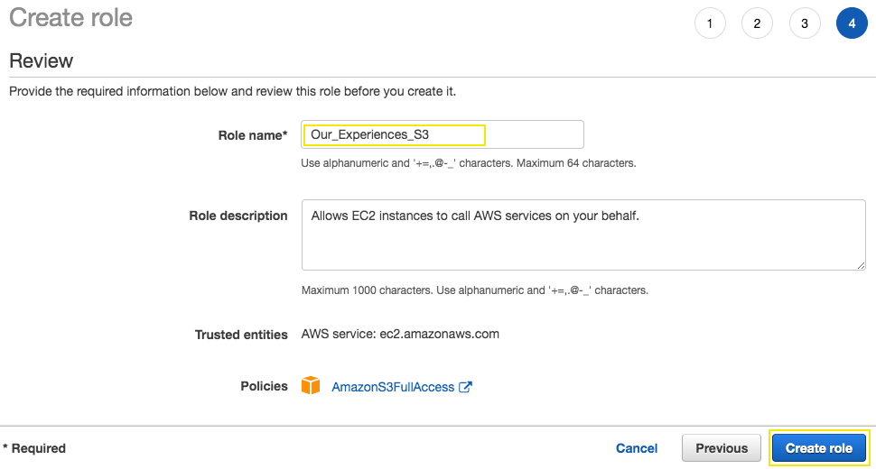

# Getting Started with AWS IAM

## 1. Create an IAM Role for EC2 Instance

1.1\.	Sign in to the AWS Management Console and open the Amazon S3 console at https://console.aws.amazon.com/iam/.

1.2\.	Choose **Roles** and **Create role**.

1.3\.	On the **Select type of trusted identity** page, you decide who or what will be able to assume this role. For this lab, we will create a role that allows an EC2 instance to read files in S3. Therefore, we will stay on the **AWS service** tab and select **EC2**. Go to **Next: Permissions**.

1.4\.	Attach a managed policy with S3 Read Only access to the role by typing `s3` into the search bar, and then selecting the **AmazonS3FullAccess** policy, choose **Next: Tags**.

1.5\.	Choose **Next: Review**.

1.6\.	Give your role a **Name**, type `Our_Experiences_S3` and choose **Create Role**.

