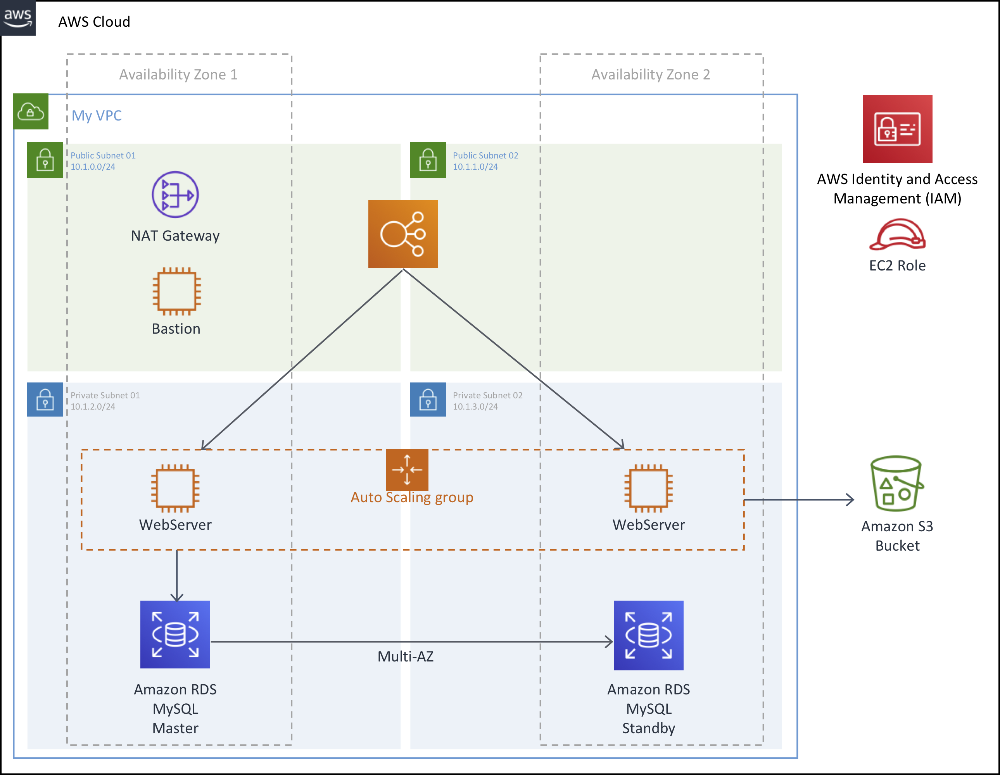

# AWS Core Services with Auto Scaling

Hello, this is a self-paced workshop designed to explore the AWS Core Services.

In this workshop, you will build 2-tier application architecture with Auto Scaling that covers core services and best practices for Compute, Networking, Storage and Databases.

See the diagram below for a depiction of the complete architecture.

You must complete the following modules in **US East (N. Virginia)** region in order before proceeding to the next:

